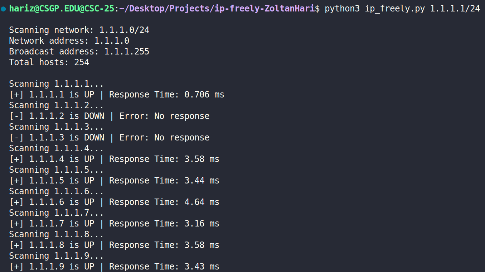

[](https://classroom.github.com/a/1Lpan6Kl)
[](https://classroom.github.com/open-in-codespaces?assignment_repo_id=21200553)
# IP Freely
IP Freely is a Python script that scans a CIDR network range based on a users input and pings each host to see which IP addresses are online. It displays whether each IP address is up or down along with its response time.


## Requirements

- Python 3 or higher
- Git

## Installation

1. Clone the Repository
```bash
git clone https://github.com/WTCSC/ip-freely-ZoltanHari.git
```
2. Open the Cloned Repository
```bash
cd ip_freely-ZoltanHari
```

## Usage

1. Start the program with the command **`python3 ip_freely.py <CIDR>`** in the terminal

2. Wait for the program to ping all of the IP addresses in the network range


## Usage Example


